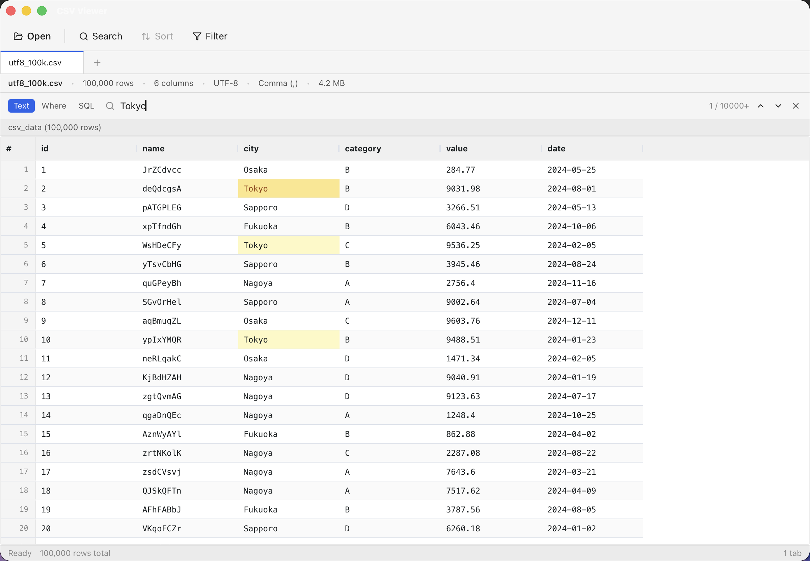

# CSV Viewer

[](https://github.com/proxit-inc/csv-viewer/releases)
[](https://github.com/proxit-inc/csv-viewer/releases)
[](LICENSE)

A fast, local CSV file viewer for macOS. View large files (100k+ rows) across multiple tabs with instant search, SQL filtering, and sorting — no data ever leaves your machine.

Built with **Tauri 2** + **React 18** + **TypeScript** + **DuckDB**.



---

## Features

- **Multi-tab viewing** — open multiple CSV/TSV files simultaneously, each with its own independent in-memory DuckDB connection
- **Large file support** — 100,000 rows load in under 3 seconds; virtual scrolling keeps memory under 200 MB
- **Auto-detection** — delimiter (`,` / `\t` / `;`) and encoding (UTF-8, Shift_JIS, EUC-JP) detected automatically
- **Full-text search** — `⌘F` opens an inline search bar with result count, keyboard navigation, and matching cells highlighted directly in the grid
- **Filter with SQL `WHERE`** — type a predicate like `amount > 1000 AND city LIKE '%Tokyo%'` to narrow the grid to matching rows, with a live preview as you type
- **Query with SQL** — run any `SELECT` against the loaded file (`SELECT city, count(*) AS n FROM csv_data GROUP BY city`) in a built-in editor with column autocomplete
- **Sortable columns** — click a header to sort; numeric columns sort numerically, not alphabetically
- **Column resizing** — drag headers to resize, double-click to auto-fit
- **Offline & private** — no network calls, no telemetry, no cloud; queries are read-only and cannot modify your CSV or reach any other file

---

## Searching, Filtering & Querying

`⌘F` opens the search bar on the active tab. It has three modes, switched with the **Text / Where / SQL** buttons on its left (or `⌘⇧F` to jump straight to SQL, or the toolbar's **Filter** button for Where).

### Text — find

Type a term; every matching cell is highlighted in the grid and the counter shows `3 / 128`. `Enter` / `Shift+Enter` step through hits. Searches stop after 10,000 hits, marked with a trailing `+` (`3 / 10000+`).

### Where — filter rows

Type a SQL `WHERE` fragment. A preview of the first matching rows appears below the input as you type; press `⌘Enter` to apply it to the grid.

```sql
amount > 1000 AND city LIKE '%Tokyo%'
```

- The bar above the grid reports the result — `100,000 rows → filtered (1,234 rows) · 42ms` — with a **Reset** link back to the full file.
- The `#` column keeps showing each row's **original** line number in the file.
- `↑` / `↓` in the input recall your recent predicates for that tab (last 50, kept in memory only).

### SQL — query

A full editor for arbitrary `SELECT` statements. **The loaded file is the table `csv_data`** — that's the name to write in every query:

```sql
SELECT city, count(*) AS n FROM csv_data GROUP BY city ORDER BY n DESC
```

- `⌘Enter` applies, same preview / result bar / **Reset** flow as Where mode.
- `Ctrl+Space` autocompletes your file's actual column names.
- Results can have entirely different columns from the file (an aggregation, a projection); when a query doesn't preserve original rows, `#` falls back to numbering the result.

### Chaining and Reset

A Where filter applies to **what's currently on screen**, so filters stack — filter, then filter again to narrow further. Sorting a filtered view keeps the filter. In SQL mode the current filtered result is available as the table `csv_result`, so you can query on top of a filter with `FROM csv_result`. **Reset** always returns to the full, unfiltered file.

### Read-only, always

Queries can only read. `INSERT` / `UPDATE` / `DELETE` / `CREATE` are rejected, the CSV on disk is never written to, and the query engine cannot open any other file on your machine. Mistyped queries get plain-language errors (with a copy button) rather than raw database jargon.

---

## Requirements

- macOS 11 (Big Sur) or later
- Intel or Apple Silicon (Universal Binary)

---

## Download

Download the latest `.dmg` from the [Releases](https://github.com/proxit-inc/csv-viewer/releases) page.

---

## Keyboard Shortcuts

| Shortcut | Action |
|---|---|
| `⌘O` | Open file |
| `⌘F` | Open / focus search bar |
| `⌘⇧F` | Open search bar in SQL mode |
| `ESC` | Close search bar |
| `Enter` | Next search result (Text mode) |
| `Shift+Enter` | Previous search result (Text mode) |
| `⌘Enter` | Apply the query (in the Where input / SQL editor) |
| `↑` / `↓` | Previous / next query history entry (in the Where input) |
| `Ctrl+Space` | Column-name autocomplete (in the SQL editor) |
| `⌘W` | Close active tab |
| `⌘1`–`⌘9` | Switch to tab N |
| `⌘Q` | Quit |

---

## Build from Source

**Prerequisites**

- [Rust](https://rustup.rs/) 1.70+
- [Node.js](https://nodejs.org/) 22+ (CI builds on Node 24)
- [pnpm](https://pnpm.io/) 9+

```bash
git clone https://github.com/proxit-inc/csv-viewer.git
cd csv-viewer
pnpm install
pnpm tauri build -- --target universal-apple-darwin
```

The `.dmg` will be output to `src-tauri/target/universal-apple-darwin/release/bundle/dmg/`.

---

## Development

```bash
pnpm tauri dev          # dev server with hot-module reload

pnpm lint               # JS/TS linter (oxlint)
pnpm lint:fix           # auto-fix lint issues
pnpm fmt                # formatter (oxfmt)
cargo fmt               # Rust formatter
cargo clippy            # Rust linter
cargo test              # Rust unit tests
```

For architecture details see [`docs/ARCHITECTURE.md`](docs/ARCHITECTURE.md).  
For the full Japanese implementation specification see [`docs/IMPLEMENTATION.md`](docs/IMPLEMENTATION.md).

---

## License

[MIT](LICENSE) © PROXIT, Inc.
