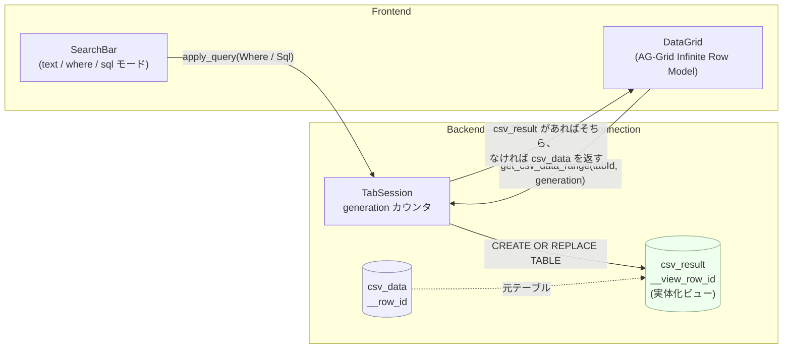
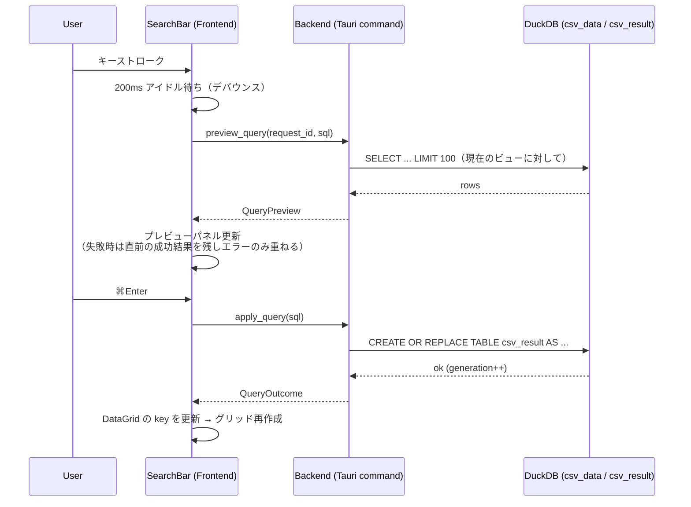
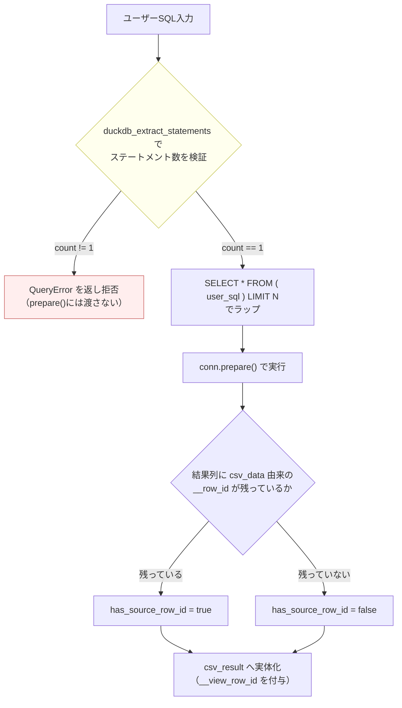

# CSV Viewer — Search & SQL Architecture Proposal

> **Language note:** This document is written in Japanese. For the existing Phase 1 architecture see [`ARCHITECTURE.md`](ARCHITECTURE.md) / [`IMPLEMENTATION.md`](IMPLEMENTATION.md).
>
> **Summary (EN):** Architecture proposal for extending the current text-only search (`search_csv`, per-column `LIKE` loop) with a WHERE-clause filter mode and a raw-SQL query mode against the per-tab in-memory DuckDB `csv_data` table. Introduces a backend "view pipeline" (`csv_result` materialized table + `generation` counter) shared by search, the planned Phase 2 sort/filter, and future SQL search, so all three land on one mechanism instead of three. Includes a from-scratch security review: the originally proposed "single-statement `prepare()`" safety boundary was verified against the actual `duckdb-rs` crate source and found to be ineffective (intermediate statements in a multi-statement input are executed before the final statement is prepared) — see §4 for the corrected mitigation. Status: **proposal / not yet implemented**. Step 1 (backend refactor of existing text search into a single query) carries no user-visible change and no new risk; later steps are gated as described in §5.

---

# CSV Viewer 検索機能アーキテクチャ提案（SQL検索を含む）

**バージョン**: Rev.2
**作成日**: 2026年8月
**ステータス**: 提案（未実装）

## 背景

現在の検索機能（⌘F）は `src-tauri/src/commands/search.rs` の `search_csv` が、列ごとに `LIKE` クエリを逐次実行し `(row, column)` のヒット一覧を返す方式。Phase 2 として計画されているソート・フィルタは `Toolbar.tsx` に disabled のボタンとして存在するのみで未実装。

本ドキュメントは、[DuckDB Instant SQL / Local UI](https://dev.classmethod.jp/articles/instant-sql-duckdb-local-ui/) を参考に、検索機能へ SQL（WHERE句フィルタ・生SQL）対応を追加するための設計を提案する。設計は Opus モデルによる初期提案を Fable モデルが独立レビューし、実装クレートのソースコード検証に基づく修正を反映した Rev.2。

---

## 0. 全体方針

タブごとに「今グリッドが表示している関係（relation）」を差し替えられる*ビュー・パイプライン*をbackendに導入する。テキスト検索・WHEREフィルタ・生SQL・Phase 2のソート/フィルタが、すべてこの1つの仕組みの上に乗る。

- テキスト検索（⌘F）は**ハイライト方式**のまま残す（SQLでは表現できない別UXのため統合しない）。
- SQLは**結果集合を差し替える方式**。
- 安全境界は多層防御とする（詳細は§4）。

### 0-1. アーキテクチャ概観



`text`モードはこのビュー・パイプラインを経由せず、現在表示中のビュー（`csv_result`または`csv_data`）に対して直接ハイライト用のヒット検索を行う（§2-5）。`where`/`sql`モードはビューそのものを差し替える。

既存コードで見つかった問題点も併せて修正対象とする：
- `search()`の`total_count`はtruncate**後**の件数のため、10,000件超のとき打ち切りが伝わらない
- 列ごとに`LIMIT 10,000`を掛けてから全体truncateしているため、ヒットが**左側の列に偏る**
- 列数N本に対しN回の逐次クエリ（100列CSVなら100往復）

---

## 1. 機能スコープ

### 3モード制（`SearchBar`にモードトグルを追加）

| モード | 入力 | 結果の形 | グリッドへの反映 |
|---|---|---|---|
| `text`（既定・現状） | `Tokyo` | `SearchHit[]`（row, column） | セルをハイライト、Enterで移動 |
| `where` | `amount > 1000 AND city LIKE '%Tokyo%'` | 元行の部分集合（列は同じ） | グリッドを**絞り込み表示** |
| `sql` | `SELECT city, sum(amount) FROM csv_data GROUP BY 1` | 任意の列・行 | グリッドを**結果集合に差し替え** |

**第1イテレーション（推奨スコープ）**: `text`モードの単一クエリ化（見た目の変更なし）＋ `where`モード（WHERE句断片のみ入力、結果は絞り込み表示、`#`列には元ファイルの行番号）＋ 入力中のインクリメンタルなプレビュー。

**ストレッチ（第2イテレーション）**: `sql`モード（`csv_data`に対する任意のSELECT/WITH、集約・自己結合・PIVOTも許可）＋ CodeMirror 6エディタ + 列名補完 ＋ クエリ履歴。

**やらないこと（明示）**:
- **自然言語 → SQL（LLM連携）**: 参考資料の方向性の一つだが、本アプリの「ネットワーク通信なし」という製品保証と衝突するため対象外。
- **複数タブを跨ぐJOIN**: タブごとに独立したDuckDB接続という現アーキテクチャを壊すため対象外。
- **CSVの書き込み・エクスポート**: read-onlyビューアの原則を維持。

---

## 2. Backend設計

### 2-1. stateの拡張

```rust
// src-tauri/src/state.rs
pub struct TabSession {
    pub conn: Arc<Mutex<Connection>>,
    pub result: Mutex<Option<ResultView>>,  // 現在グリッドが読む関係。Noneならcsv_data
}
pub struct ResultView {
    pub table: String,
    pub columns: Vec<String>,
    pub total_rows: usize,
    pub has_source_row_id: bool,
    pub generation: u64,  // stale要求の破棄に使用
}
pub struct DuckDBState { pub tabs: Mutex<HashMap<String, Arc<TabSession>>> }
```

### 2-2. 新規・変更IPCコマンド

```rust
pub fn search_csv(tab_id: String, query: String, state: State<DuckDBState>) -> Result<SearchResponse, String>  // 実装のみ単一クエリ化

#[tauri::command]
pub async fn apply_query(tab_id: String, request: QueryRequest, state: State<'_, DuckDBState>) -> Result<QueryOutcome, String>
#[tauri::command]
pub async fn preview_query(tab_id: String, request: QueryRequest, request_id: u64, state: State<'_, DuckDBState>) -> Result<QueryPreview, String>
#[tauri::command]
pub fn clear_query(tab_id: String, state: State<DuckDBState>) -> Result<QueryOutcome, String>

#[derive(Deserialize)] #[serde(tag = "mode", rename_all = "camelCase")]
pub enum QueryRequest { Where { predicate: String, sort: Vec<SortSpec> }, Sql { sql: String } }
```

### 2-3. `get_csv_data_range`：generationはエラーではなくサイレント破棄

```rust
pub fn get_csv_data_range(tab_id: String, start_row: usize, end_row: usize,
                          generation: u64, state: State<DuckDBState>) -> Result<DataRange, String>
```

`key={tabId}:{generation}`でAG-Gridインスタンスを再作成する設計を採るため、旧グリッドのコールバックはAG-Grid側で実質無視され、既存`datasource.ts`の`latestReqId`ガードも既にレースを潰している。サーバ側でgeneration不一致を**エラーとして返す**設計は、`failCallback`経由のAG-Gridリトライや`SET_ERROR`の誤発火を誘発しかねない。

**採用する設計**：サーバはgeneration不一致でも正常応答として現在のビューから返し、`DataRange`に応答時点の`generation`を同梱する。フロント（`datasource.ts`）側で「リクエスト時と応答のgenerationが不一致なら黙って破棄」する1行のガードを追加する（既存`latestReqId`ガードと同列の軽量チェック）。`DataRange`に`row_ids: Option<Vec<usize>>`も追加し、`#`列に元ファイル行番号を表示できるようにする。

### 2-4. ビューの実体化方針とカラム名衝突対策

`apply_query`は`CREATE OR REPLACE TABLE csv_result AS ...`で実体化する（VIEWにしない理由：ページングに必要な安定した序数が毎回再計算される、`COUNT(*)`が毎回フルスキャンになる、`ORDER BY`含みで走査順が保証されない）。

**注意（実装時のバグ回避）**：`csv_data`は既に`__row_id`列を持つため、`sql`モードで`SELECT * FROM csv_data`のような入力に単純に`row_number() OVER () AS __row_id, *`を被せると**カラム名が重複しCTASが失敗する**。実体化用の内部連番カラムは`csv_data`側と衝突しない名前（`__view_row_id`）を使う。

```sql
CREATE OR REPLACE TABLE csv_result AS
SELECT (row_number() OVER () - 1) AS __view_row_id, *
FROM ( <ユーザークエリ> )
LIMIT 1000001;   -- MAX_RESULT_ROWS + 1 でtruncated検出（後述、外側LIMITは防御目的ではない）
```

`has_source_row_id`は結果列に（`csv_data`由来の）`__row_id`が残っているかを実行後に見るだけで判定する（AST解析しない。`SELECT *`なら残る、`GROUP BY`なら消える）。`where`モードでは引き続き元の`__row_id`を`__src_row_id`として持ち回す。

メモリは最悪ケース（全行マッチ）で`csv_data`+`csv_result`の2倍。100k行なら200MB目標に余裕があるが、新結果作成前に古い`csv_result`をDROPする。将来100万行規模を扱う場合は要再検討。

### 2-5. テキスト検索の単一クエリ化

N回の逐次クエリを1クエリに畳む。全列VARCHARのため`CAST`は不要。

```sql
WITH exploded AS (
  SELECT __row_id AS rn, unnest(["col_a", "col_b", ...]) AS val, unnest([0, 1, ...]) AS col
  FROM csv_data
)
SELECT rn, col FROM exploded WHERE val LIKE $1 ESCAPE '\' ORDER BY rn, col LIMIT 10001
```

1スキャン・1往復。並び替え/打ち切りをエンジン側で行うため列偏りバグも消える。列名は現状どおり`"`二重化でエスケープ、パターンはバインドパラメータのまま。`unnest`のzip展開が期待通りでない場合のフォールバックは「列ごとのSELECTを`UNION ALL`で1ステートメントに連結」。実装時に両方を計測して選択する。検索対象は**現在のビュー**（`csv_result`があればそちら）にすることで、フィルタ後の検索が自然に動作する。`SearchResponse`に`truncated: bool`を追加。

### 2-6. Send/Sync とタイムアウト・キャンセル（実クレート検証済み）

実際にプロジェクトが使う`duckdb`クレート（`duckdb-1.10502.0`）のソースを直接確認した結果：

- `src/lib.rs:240`に`unsafe impl Send for Connection {}`が明示されている。**CLAUDE.mdの「`Connection` is not `Send`」は誤記で、正しくは`!Sync`。** `Arc<Mutex<Connection>>` + `spawn_blocking`によるasync化は技術的に妥当。
- `Connection::interrupt_handle() -> Arc<InterruptHandle>`が存在し、`InterruptHandle: Send + Sync`（`inner_connection.rs:300-301`）。クエリ実行中でもMutexを握ったまま、別スレッドのウォッチャーからハンドル経由でinterrupt可能。

```rust
let handle = conn.interrupt_handle();
// preview: 2000ms / apply: 10000ms 経過で handle.interrupt()
```

これにより、`apply_query`/`preview_query`はasyncコマンド化し`tauri::async_runtime::spawn_blocking`で実行、タイムアウト時は`interrupt_handle()`でキャンセルする設計が実装可能と確認できた（既存の同期`get_csv_data_range`は変更不要）。

---

## 3. Frontend設計

### 3-1. SQLエディタ：CodeMirror 6を推奨（Monacoは不採用）

| | CodeMirror 6 | Monaco |
|---|---|---|
| バンドル | core + `@codemirror/lang-sql`で~60–80KB gz | ~1MB gz超 + Web Worker群 |
| 初期化 | 数ms | 数十〜数百ms、worker起動あり |

起動2秒・メモリ200MBという目標を持つ「軽量CSVビューア」にMonacoは明確に過剰。`import()`で遅延ロードし、SQLモードを初めて開くまでコストを払わない構成にする。`@codemirror/lang-sql`の`schema`オプションに`{csv_data: metadata.headers}`を渡すだけで列名補完が効く（実装コストほぼゼロで効果大）。Step 2（`where`モード、1行入力）は素の`<input>`のままでよく、CodeMirrorはStep 3で導入。

### 3-2. 状態設計

`CsvTab`に`searchMode`／`queryDraft`／`query`／`queryStatus`／`resultView`／`preview`を追加。アクション：`SEARCH_MODE_SET`／`QUERY_DRAFT_SET`／`QUERY_PREVIEW_UPDATE`／`QUERY_RUN_START/SUCCESS/ERROR`／`QUERY_CLEAR`。

**併せて`AppState.isSearchOpen`をタブごと（`CsvTab.isSearchOpen`）へ移すことを推奨** — SQLパネルの開閉はタブ固有のはずで、グローバルのままだとタブ切替のたびに他タブのSQLパネルが開く挙動になる。Step 2で同時に直す。

### 3-3. Instant SQL風UXと、プレビュー/適用の対象関係の明文化

参考資料の「Instant SQL」の本質は*カーソル位置の部分実行*ではなく**「実行ボタンを押す前に結果が見えている」**ことなので、そこだけ取る。



100k行×VARCHARのLIKE/比較フィルタはDuckDBで数ms〜十数ms。プレビューp95 **150ms以内**を目標。失敗中のプレビューで画面を空にせず、**直前の成功結果を残したままエラーだけ重ねる**のが体感を左右する。

**仕様として固定する**：`preview_query`・`apply_query`は共に「タブの現在のビュー」（`csv_result`が存在すればそれ、なければ`csv_data`）に対して実行する。`where`モードで絞り込んだ後に`sql`モードへ切り替えると、絞り込み後の`csv_result`に対してSQLを書くことになる。`Reset`（`clear_query`）を押すと`csv_result`をDROPし、以降は`csv_data`が対象に戻る。結果バーに「現在何に対してクエリしているか」を明示する（例: `csv_data (100,000 rows)` → `filtered (1,234 rows)`）。

### 3-4. グリッド統合：専用の結果グリッドは作らない

結果の形はいずれも「列名配列＋行配列」に落ちるため、`DataGrid`を1つのまま使い回す。
1. `columns` propを追加（`activeTab.resultView?.columns ?? metadata.headers`）
2. `key={`${activeTab.id}:${generation}`}` — ビュー切替でグリッドを作り直せば列定義・キャッシュ・スクロール位置がまとめてリセットされ、`purgeInfiniteCache()`呼び忘れによる不整合を構造的に排除
3. `datasource`に`generation`を渡し`get_csv_data_range`に伝播
4. `#`列は`row_ids`があれば元ファイル行番号、なければ結果内序数
5. ハイライトは現在のビューに対して検索するので無変更で動作

グリッド上部に薄い**結果バー**（`1,234 rows · 42 ms · filtered` + Resetボタン + 打ち切り警告）を追加。プレビューはエディタ直下の別パネル（先頭100行）に出し、本体グリッドはコミット後に変える方式を推奨（本体を打鍵中に書き換えるとスクロール位置が飛ぶ）。

### 3-5. Phase 2のソート/フィルタとの関係

SQL検索がFilterを「置き換える」のではなく、両者が同じbackend契約に落ちる形にする。`apply_query`を`QueryRequest::Where{predicate, sort}`で作っておけば、AG-Gridの列ヘッダソート・列フィルタは「UIから`SortSpec[]`を組み立てて同じコマンドを呼ぶだけ」になる。**結論：Toolbarのソート/フィルタボタンは残し、このビュー・パイプラインの上に載せる** — Phase 2実装がほぼUI作業だけになるのが、この設計を採る最大の理由。

---

## 4. 安全性・バリデーション

ローカル単一ユーザー・ネットワークなしのため「攻撃者」はいないが、**ユーザー自身の誤操作**（`DROP TABLE csv_data`、意図しない`COPY ... TO`、`read_csv('/etc/passwd')`）が現実的リスク。

### 4-1. 当初案の問題点（実装クレートを検証して判明）

当初「`SELECT * FROM (<user_sql>) LIMIT N`でラップし、`conn.prepare()`（単一ステートメントのみ受け付ける）を安全境界にする」という案を検討したが、**これは`duckdb-rs`の実装上機能しない**。

`prepare()`の内部実装（`inner_connection.rs:136-156`）は、`duckdb_extract_statements`で入力を複数ステートメントに分解した後、**最後以外の中間ステートメントをその場で全て実行し**、最終ステートメントだけをprepareして返す。エラー型に`MultipleStatement`があるが、クレート内のどこからも発生させていない。つまり以下の入力はラッピングをすり抜けて`DROP TABLE`が実行される：

```sql
csv_data) LIMIT 1; DROP TABLE csv_data; --
```

さらに、ラップ後の外側`) LIMIT N`は末尾コメント（`--`）で無効化できるため、**行数上限としても機能しない**。

### 4-2. 採用する安全設計



**(a) ステートメント数の自前検証を必須の第一防壁にする**

```rust
// libduckdb-sys の duckdb_extract_statements を直接呼び、
// 分解後のステートメント数が 1 でなければ即座に拒否する。
// conn.prepare() には絶対に複数ステートメントの文字列を渡さない。
fn assert_single_statement(sql: &str) -> Result<(), CsvError> {
    let count = unsafe { /* duckdb_extract_statements 呼び出し */ };
    if count != 1 {
        return Err(CsvError::QueryError {
            message: "複数のSQL文は実行できません".into(), position: None
        });
    }
    Ok(())
}
```

これをラッピングの**前**に必ず通す。`prepare()`自体を安全境界だと信用しない。

**(b) 行数上限はラップ後のLIMITではなく、CTAS実体化側で担保**：外側`LIMIT N`は防御にならない（コメントで無効化可能）ため防御としては期待せず、実体化クエリ（`CREATE OR REPLACE TABLE csv_result AS ... LIMIT 1000001`）側の`LIMIT`で行数上限を担保する（こちらはユーザーSQLの外側にあるDuckDB構文なので無効化できない）。

**(c) DuckDBエンジン設定ロック**（CSVロード完了直後に実行）

```sql
SET enable_external_access = false;  -- ファイル/HTTP読み書き、拡張の自動ロードを全面禁止
SET lock_configuration = true;       -- ユーザークエリからの再有効化を禁止
```

`read_csv`/`ATTACH`（ファイル）/`httpfs`/`INSTALL`・`LOAD`を封じ、「ネットワーク通信なし」の製品保証をエンジンレベルでも担保する。ただし(a)の穴がある限り、in-memory内の`DROP`/`CREATE`自体は防げない点に注意（ローカル単独アプリのため実害は「そのタブのデータ破壊」に留まる）。

**(d) `sqlparser-rs`は非採用**：DuckDB方言（`SELECT * EXCLUDE`、`QUALIFY`、`PIVOT`等）を`GenericDialect`は完全にはパースできず、正当なクエリを誤って拒否するリスクがある。セキュリティ境界としてではなくUX目的でも第1段階では導入せず、DuckDBのエラーメッセージをそのまま返す（`LINE 1: ... ^`形式で位置も出るため十分正確）。

**(e) CTE（`WITH ... SELECT`）のラップ互換性は実装時に要検証**：括弧内サブクエリで`WITH`が使えるかを実装着手時にテストで確認する。通らない場合は先頭`WITH`を検出する特別扱いが必要。

### 4-3. エラー表面

`search.rs`が生`String`を返している現状を、既存の`types::CsvError`に寄せる。SQL用にvariantを追加：

```rust
#[error("Invalid query: {message}")]
QueryError { message: String, position: Option<usize> },
#[error("Query timed out after {0} ms")]
QueryTimeout(u64),
```

SQLの構文エラーは入力中に常時起きるため、**グローバルな`SET_ERROR`（画面上部の赤バー）には流さず**、エディタ直下のインラインエラーに限定する。`SET_ERROR`はIPC自体の失敗（タブ消失など）だけに使う。

---

## 5. 移行・段階計画


Step 2.5は「通過しない限りStep 3（生SQL実行）に進んではならない」ゲートとして独立させている（§4-1参照）。

| Step | 内容 | リスク |
|---|---|---|
| **1** | テキスト検索backendを単一クエリ化。`truncated`フラグ追加。`CsvError`へ移行。既存6テストが回帰テストになる（列偏りバグ用のテストを1本追加） | ほぼゼロ。単独で価値あり |
| **2** | `TabSession`/`ResultView`導入。`apply_query`等（Whereのみ）実装。DuckDB設定ロック追加。`generation`はサイレント破棄方式で実装。フロントにモードトグル・プレビューパネル・結果バー。`isSearchOpen`をタブごとに移動。**ここでToolbarのFilterボタンが有効化可能に** | 中 |
| **2.5** | `duckdb_extract_statements`による単一ステートメント検証をbackendに実装し、`DROP`/`;`連結攻撃パターンのユニットテストを追加。**このStepを通過するまでStep3（生SQL実行）に進まない** | 中〜高（`libduckdb-sys`の低レベルAPI利用） |
| **3** | `QueryRequest::Sql`実装。`__view_row_id`命名で実体化。CodeMirror 6を動的importで導入＋列名補完。`interrupt_handle()`によるタイムアウト実装 | 中 |
| **4** | AG-Gridのsortable/filterを有効化しToolbar Sortボタン連動。SQL結果への追加ソート/フィルタ合成 | 低 |
| **5（任意）** | クエリ履歴、⌘⇧FでSQLパネル直接オープン、結果コピー | 低 |

Step 2.5を独立ステップとして新設したのは、安全性に関する指摘が「実装すれば直る軽微なバグ」ではなく「単一ステートメントprepareを安全境界にする」という設計思想そのものが成立しないという性質のものだったため。ここを飛ばしてStep 3に進むと、`sql`モードが実質無防備な状態でリリースされる。

---

## 6. 判断が分かれる論点（要フィードバック）

1. **プレビューの出し先**：エディタ下の専用パネル（推奨）か、本体グリッドを直接書き換えるか。後者のほうがInstant SQLに忠実だがスクロール位置が飛ぶ。
2. **結果の実体化 vs VIEW**：実体化を推奨（ページング安定・COUNT高速）だが最悪ケースでメモリ2倍。100k行なら問題ないが、将来100万行を扱うなら再検討が必要。
3. **`sqlparser-rs`を入れるか**：第1段階では不要と判断。エディタの静的エラー表示を重視するならStep 3で追加検討。
4. **タブ横断JOIN**：現在の「タブ=独立コネクション」を諦めれば実現できるが、Step 2のメモリ解放モデル（タブを閉じたら即解放）が崩れる。今回は非対応。
5. **`duckdb_extract_statements`をどこで検証するか**：Rust側で`libduckdb-sys`の低レベルFFIを直接叩く実装コストが発生する。代替として「セミコロン区切りで文字列split → 空白除去後の要素数が1か」という簡易ヒューリスティックで一旦済ませる案もあるが、文字列リテラル内の`;`（例: `WHERE note = 'a;b'`）を誤検知する。低レベルAPIを使う方を推奨するが、実装コストは要見積もり。
6. **テキスト検索モードを残すか**：SQLで代替可能だが、⌘Fでの「ざっと探してハイライト」は別UXなので残す判断。

---

## 変更が必要な主なファイル

`src-tauri/src/commands/{search.rs, data.rs, file.rs}`、`src-tauri/src/{state.rs, types.rs, lib.rs}`、`src/store/appReducer.ts`、`src/components/{SearchBar.tsx, Toolbar.tsx, DataGrid/{DataGrid.tsx, datasource.ts}}`、`src/hooks/useSearch.ts`、`src/types/index.ts`、`src/App.tsx`

（Step 2.5向けに追加: `src-tauri/Cargo.toml`に`libduckdb-sys`への直接依存を明示的に追加する可能性あり — 現状`duckdb`クレート経由の間接依存のみ）

---

## 参考資料

- https://dev.classmethod.jp/articles/instant-sql-duckdb-local-ui/ — DuckDB Instant SQL / Local UIの紹介。「実行ボタンを押す前に結果が見えている」UXの参考元。
- https://zenn.dev/tenkao/scraps/96996339ddf4c1 — DuckDB + Claude Desktop MCPの実装例。自然言語→SQLの方向性は本アプリのネットワークなし方針と衝突するため対象外と判断（§1）。

---

**変更履歴**:
- Rev.1: Opusモデルによる初期アーキテクチャ提案
- Rev.2: Fableモデルによる独立レビュー（`duckdb-1.10502.0`クレートのソースコード検証）を反映。§2-6（Send/Sync・interrupt確認）、§2-4（`__view_row_id`衝突バグ修正）、§2-3（generation設計の見直し）、§4（安全設計の全面改訂）、§5（Step 2.5新設）
